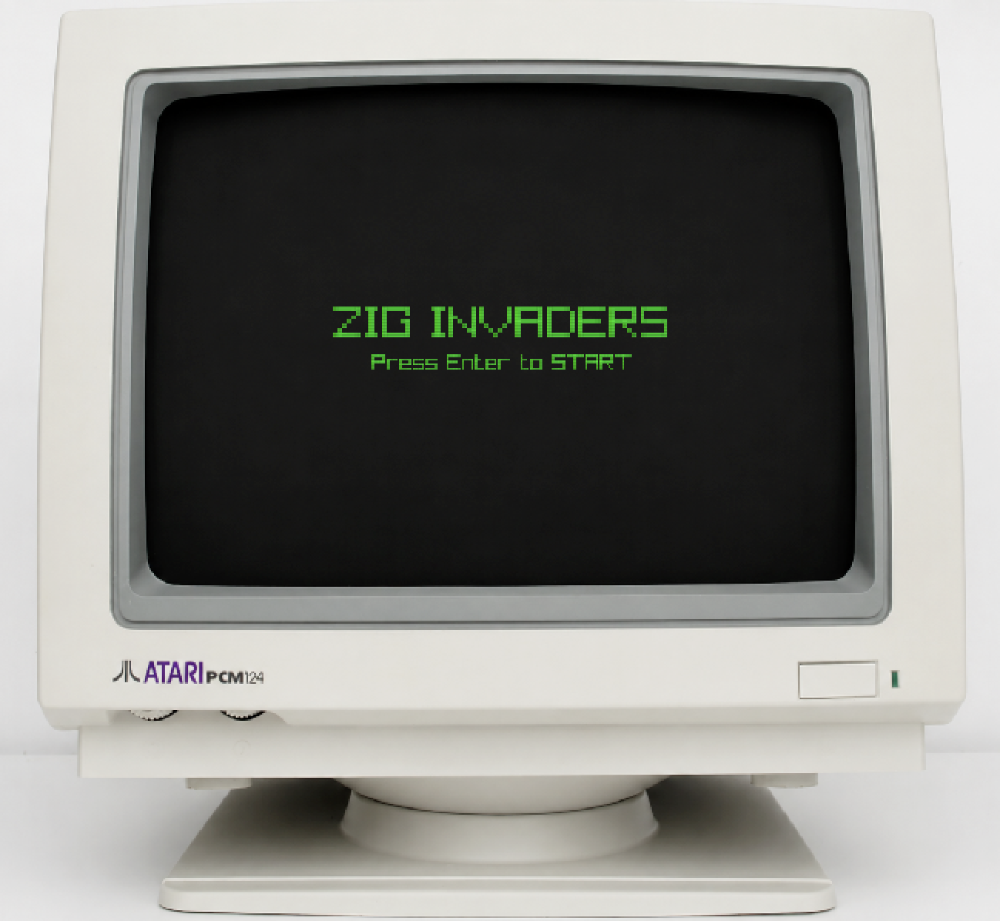

# Zig Invaders

A Space Invaders clone built with [Zig](https://ziglang.org/) and [Raylib](https://www.raylib.com/).



## Requirements

- [Zig](https://ziglang.org/download/) 0.16+

## Run

```sh
zig build run
```

## Build

```sh
# Build the binary
zig build

# Build a macOS .app bundle (output: dist/ZigInvaders.app)
zig build -Doptimize=ReleaseFast bundle
```

## macOS Gatekeeper

The app is not notarized. To bypass Gatekeeper after building the app bundle:

```sh
xattr -rd com.apple.quarantine ZigInvaders.app
```
